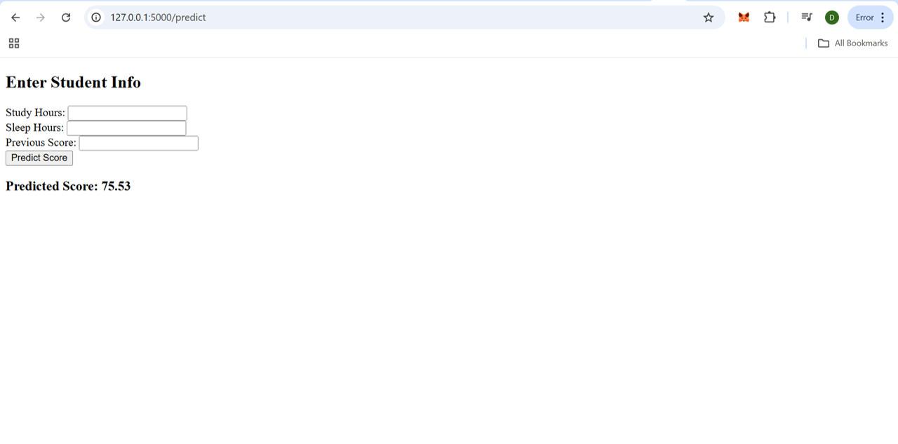

# Student Score Predictor (Flask + ML)

This is a simple Flask web app that predicts a student’s future score based on:
- Study hours  
- Sleep hours  
- Previous score  

The app uses a trained boosting model saved via `pickle`.

---

## 🧠 Model

The ML model was trained using boosting techniques (e.g., Gradient Boosting, XGBoost) on a dataset with student performance metrics. The final trained model is stored as `model/boosting_model.pkl`.

---

## ⚙️ How It Works

1. User enters input values in the form (study hours, sleep hours, previous score).
2. Flask receives the form data and passes it to the ML model.
3. Model returns a prediction.
4. The result is displayed on the page.

---

## 📷 Screenshot

---

## 🚀 Tech Stack

- Python
- Flask
- scikit-learn / XGBoost
- HTML (Jinja2 templating)
